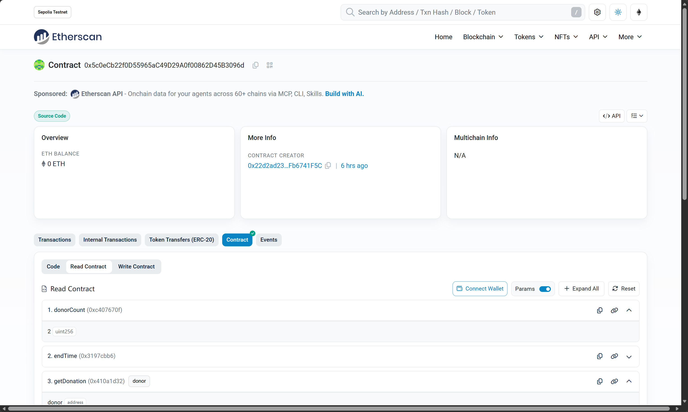
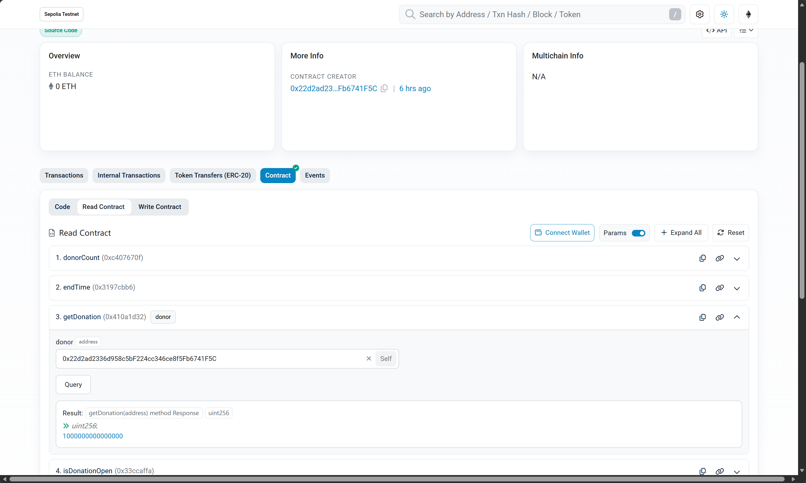
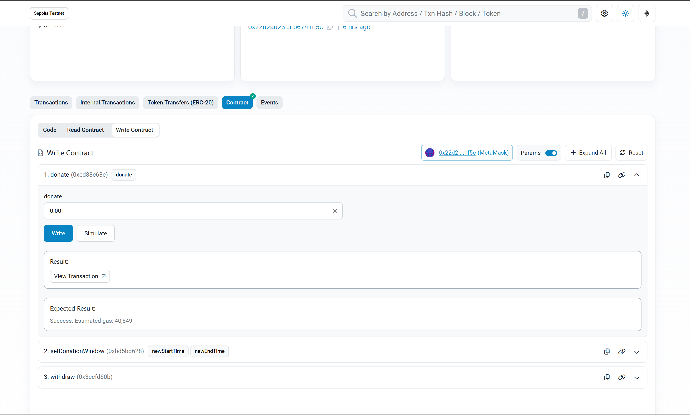

# 合约作业 02：讨饭合约 BeggingContract

对应 MetaNodeAcademy `LearningRoadmap` 的 `contract/homework02.md`：任何人都能向合约捐赠 ETH，
合约记录每位捐赠者的累计金额，由 owner 提取全部资金。

## 作业要求对照

| 作业要求 | 实现位置 |
|---|---|
| 合约名为 `BeggingContract` | [`src/BeggingContract.sol`](src/BeggingContract.sol) |
| mapping 记录捐赠者地址与金额 | `mapping(address => uint256) private _donations` |
| `donate` 函数，接收 ETH 并记录 | `donate() external payable` |
| `withdraw` 函数，owner 提取全部资金 | `withdraw() external onlyOwner`，使用 `address.transfer` |
| `getDonation` 查询某地址捐赠金额 | `getDonation(address) external view` |
| `payable` 修饰符 | `donate()` 与 `receive()` 均为 `payable` |
| `onlyOwner` 限制提款 | `modifier onlyOwner` + `owner` 在构造函数中设为部署者 |

额外挑战三项全部完成：

| 可选挑战 | 实现 |
|---|---|
| 捐赠事件 | `event Donation(donor, amount, donorTotal, totalDonated)`，另有 `Withdrawal`、`DonationWindowUpdated` |
| 捐赠排行榜 | `topDonors()` 返回金额最高的前 3 名（不足 3 人时其余位置为 0） |
| 时间限制 | `setDonationWindow(start, end)` + `isDonationOpen()`，owner 可限定只有特定时间段内能捐赠 |

## 合约接口

| 函数 | 说明 |
|---|---|
| `donate() payable` | 捐赠 ETH，金额记在 `msg.sender` 名下 |
| `receive() payable` | 直接向合约地址转账同样计为捐赠 |
| `withdraw()` | 仅 owner，提取合约全部余额，使用 `address.transfer` |
| `getDonation(address)` | 查询某地址累计捐赠金额 |
| `totalDonated()` | 合约累计收到的捐赠总额 |
| `donorCount()` | 捐赠者数量 |
| `topDonors()` | 返回 `(address[3], uint256[3])` 捐赠排行榜 |
| `isDonationOpen()` | 当前是否处于可捐赠时间窗内 |
| `setDonationWindow(start, end)` | 仅 owner，设置捐赠时间窗；传 0 表示该侧不限制 |

## 本地运行

```bash
cd contract/homework02

forge build
forge test          # 19 个用例
forge fmt --check
```

测试结果：**19 passed，0 failed**，覆盖捐赠记账、多地址累加、直接转账、零金额拒绝、
非 owner 提款被拒、空余额提款被拒、提款后记录保留、排行榜排序、时间窗开关等场景。

## 部署到 Sepolia 测试网

```bash
export SEPOLIA_RPC_URL=https://ethereum-sepolia-rpc.publicnode.com
export PRIVATE_KEY=0x...        # 有测试币的账户私钥，仅本地使用

# 方式一：脚本部署
forge script script/Deploy.s.sol:DeployBegging --rpc-url $SEPOLIA_RPC_URL --private-key $PRIVATE_KEY --broadcast

# 方式二：一行命令部署
forge create src/BeggingContract.sol:BeggingContract --rpc-url $SEPOLIA_RPC_URL --private-key $PRIVATE_KEY --broadcast

# 源码验证（需要 Etherscan API Key）
forge verify-contract <合约地址> src/BeggingContract.sol:BeggingContract --chain sepolia --etherscan-api-key $ETHERSCAN_API_KEY
```

也可以在 Remix 中编译同一个文件，用 MetaMask 部署到 Sepolia，合约构造函数没有参数，直接 Deploy 即可。

### 部署信息

| 项目 | 值 |
|---|---|
| 网络 | Sepolia（chainId 11155111） |
| 合约地址 | `0x5c0eCb22f0D55965aC49D29A0f00862D45B3096d` |
| 部署交易 | `0x308c5bb848b31213f0c3b3af0c010bc9449491829cbe8a8aa9a8cf50c16158eb` |
| 示例捐赠交易 | `0x29d94dce7c9eba391849adf06002a01c464aee93ca09a9641c666f44b1b00a1f`（0.001 ETH） |
| 第二笔捐赠（receive） | `0xe30052cf09ec20030a505dc1e2bbaa5e4ad4289b59e2f50889702f30ec99ce5b`（0.0005 ETH） |
| 第三笔捐赠（Etherscan 实测） | `0x1093bea8a24e456c050bc4d53ab4e59069d67bef468b07535f4fa6482dd813db`（0.001 ETH） |
| 提款交易 | `0x7274d239f66dc34065fcab168a3cb813642af2c547f900a1c004e3e6c00a2848` |
| 源码验证 | Sourcify `exact_match` + Etherscan Verify and Publish 均已通过 |
| 详细记录与截图清单 | [SEPOLIA_DEPLOYMENT.md](./SEPOLIA_DEPLOYMENT.md) |

## 测试截图（作业提交项）

Sepolia 真链上的完整测试证据，全部可在区块浏览器按交易哈希核对：

| 截图 | 内容 | 文件 |
|---|---|---|
| Etherscan 合约页（源码已验证） | `Source Code` 标识 + Code / Read / Write 三个标签 | [etherscan-contract-verified.png](./screenshots/etherscan-contract-verified.png) |
| Read Contract 调用结果 | `donorCount`、`getDonation` 返回 `1000000000000000` | [etherscan-read-contract-getdonation.png](./screenshots/etherscan-read-contract-getdonation.png) |
| Read Contract 全量视图 | `getDonation` / `owner` / `topDonors` / `totalDonated` | [etherscan-read-contract-overview.png](./screenshots/etherscan-read-contract-overview.png) |
| Write Contract · donate | 连接 MetaMask，捐赠 0.001 ETH，交易成功 | [etherscan-write-contract-donate.png](./screenshots/etherscan-write-contract-donate.png) |
| MetaMask 确认 withdraw | 请求来自 sepolia.etherscan.io，确认提取资金 | [etherscan-metamask-withdraw-confirm.png](./screenshots/etherscan-metamask-withdraw-confirm.png) |
| Remix 编译与部署 | Remix 2.5.7 编译 `BeggingContract` 并部署出 Contracts 实例 | [remix-compile-and-deploy.png](./screenshots/remix-compile-and-deploy.png) |
| Sourcify 源码验证 | `Exact Match`（creation + runtime） | [sourcify-verified.png](./screenshots/sourcify-verified.png) |







## 实现说明

- **`address.transfer` 的取舍**：作业要求使用 `transfer`，它会限制接收方只有 2300 gas。
  生产环境更推荐 `call{value: ...}("")` 并检查返回值，本实现按作业要求保留 `transfer`，并在注释中说明。
- **兜底记账**：额外实现了 `receive()`，所以用钱包「直接转账」到合约地址也会被统计，不会出现资金入账但记录为空的情况。
- **提款不重置记录**：`withdraw` 只转走余额，`_donations` 与 `totalDonated` 保留，便于对账；再次捐赠后可再次提款。
- **重入风险**：先发事件再转账、且使用 `transfer` 限制 gas，作业场景下无重入路径；生产合约应加 `nonReentrant` 并改用 `call`。
- **排行榜实现**：`topDonors()` 是 `view` 函数，遍历捐赠者列表维护前三名，链上规模大时应改用链下索引。
